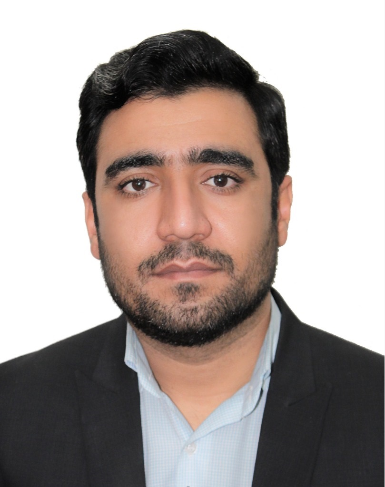

# 👨‍🔬 Dr. Sajjad Sadeghi - Research Portfolio

**PhD in Toxicology** | Semnan University of Medical Sciences  
📧 s.sadeghi@mazums.ac.ir | 📱 +98 915 983 9718  

---

## 🧪 Research Interests
- Forensic Toxicology & Analytical Chemistry
- Drug & Poison Analysis (HPLC, GC-MS, LC-MS)
- Nanotechnology in Detoxification
- Herbal Medicine Safety & Adulteration

---

## 🎓 Education
- **PhD in Toxicology** – Mazandaran Univ. of Med. Sci.

---

## 📄 Selected Publications (ISI/Scopus)
1. Microfluidic Techniques in the Development of PLGA Nanoparticles... *Toxicology Research*, 2025.
2. The pulmoprotective effects of pirfenidone against paraquat... *Egyptian Journal of Bronchology*, 2025.
3. Detection of Undeclared Methamphetamine in Weight Loss Herbal Supplement, 2025.
4. [View all publications on Google Scholar](https://scholar.google.com/citations?hl=en&user=sHtkwKsAAAAJ)

---

## 🛠️ Core Skills
- **Analytical**: GC-MS, HPLC, LC-MS, IC, ELISA, PCR, RT-PCR, Gel Electrophoresis, Flowcytometery
- **Software**: SPSS, GraphPad Prism, R, STATA, EndNote, Python, Image J, Github, Molecular docking
- **Standards**: ISO/IEC 17025, Quality Control, Laboratory Auditing

---

## 🏆 Achievements
- Member of the National Forensic Medicine Research Center
- Top-ranked laboratory supervisor in Iran (3 consecutive years)
- 1st place in Health Startup Weekend (Wastewater heavy metal removal using nanoparticles) – 2022

---

## 📌 Current Position
- Expert in Pharmaceutical Education & Research, Food and Drug Administration, Semnan Univ. of Med. Sci.
- Instructor of Pharmacology & Toxicology (Pharmacy, Nursing, Midwifery)

---

> 🔗 **Google Scholar**: [Click here](https://scholar.google.com/citations?hl=en&user=sHtkwKsAAAAJ)  

> 📂 This portfolio is hosted on GitHub Pages.
